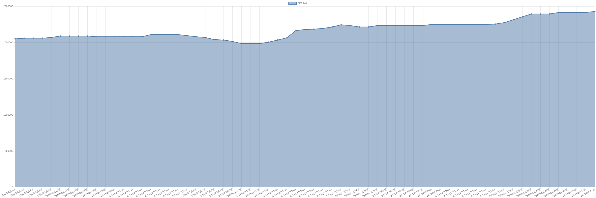

# 镝铁合金价格变动趋势 

| 时间 | 价格 | 消息正文 |
|:--:|:--:|:--:|
|2023年8月4日|2235000|8月4日镝铁合金为2235000.00|
|2023年8月3日|2235000|8月3日镝铁合金为2235000.00|
|2023年8月2日|2235000|8月2日镝铁合金为2235000.00|
|2023年8月1日|2235000|8月1日镝铁合金为2235000.00|
|2023年7月31日|2235000|7月31日镝铁合金为2235000.00|
|2023年7月28日|2215000|7月28日镝铁合金为2215000.00|
|2023年7月27日|2215000|7月27日镝铁合金为2215000.00|
|2023年7月26日|2235000|7月26日镝铁合金为2235000.00|
|2023年7月25日|2245000|7月25日镝铁合金为2245000.00|
|2023年7月24日|2215000|7月24日镝铁合金为2215000.00|
|2023年7月21日|2195000|7月21日镝铁合金为2195000.00|
|2023年7月20日|2185000|7月20日镝铁合金为2185000.00|
|2023年7月19日|2180000|7月19日镝铁合金为2180000.00|
|2023年7月18日|2165000|7月18日镝铁合金为2165000.00|
|2023年7月17日|2065000|7月17日镝铁合金为2065000.00|
|2023年7月14日|2035000|7月14日镝铁合金为2035000.00|
|2023年7月13日|2005000|7月13日镝铁合金为2005000.00|
|2023年7月12日|1985000|7月12日镝铁合金为1985000.00|
|2023年7月11日|1985000|7月11日镝铁合金为1985000.00|
|2023年7月10日|1985000|7月10日镝铁合金为1985000.00|
|2023年7月7日|2015000|7月7日镝铁合金为2015000.00|
|2023年7月6日|2035000|7月6日镝铁合金为2035000.00|
|2023年7月5日|2040000|7月5日镝铁合金为2040000.00|
|2023年7月4日|2070000|7月4日镝铁合金为2070000.00|
|2023年7月3日|2080000|7月3日镝铁合金为2080000.00|
|2023年6月30日|2095000|6月30日镝铁合金为2095000.00|
|2023年6月29日|2110000|6月29日镝铁合金为2110000.00|
|2023年6月28日|2110000|6月28日镝铁合金为2110000.00|
|2023年6月27日|2110000|6月27日镝铁合金为2110000.00|
|2023年6月26日|2110000|6月26日镝铁合金为2110000.00|
|2023年6月23日|2080000|6月23日镝铁合金为2080000.00|
|2023年6月22日|2080000|6月22日镝铁合金为2080000.00|
|2023年6月21日|2080000|6月21日镝铁合金为2080000.00|
|2023年6月20日|2080000|6月20日镝铁合金为2080000.00|
|2023年6月19日|2080000|6月19日镝铁合金为2080000.00|
|2023年6月16日|2080000|6月16日镝铁合金为2080000.00|
|2023年6月15日|2090000|6月15日镝铁合金为2090000.00|
|2023年6月14日|2090000|6月14日镝铁合金为2090000.00|
|2023年6月13日|2090000|6月13日镝铁合金为2090000.00|
|2023年6月12日|2090000|6月12日镝铁合金为2090000.00|
|2023年6月9日|2070000|6月9日镝铁合金为2070000.00|
|2023年6月8日|2060000|6月8日镝铁合金为2060000.00|
|2023年6月7日|2060000|6月7日镝铁合金为2060000.00|
|2023年6月6日|2060000|6月6日镝铁合金为2060000.00|
|2023年6月5日|2050000|6月5日镝铁合金为2050000.00|
|2023年6月2日|2050000|6月2日镝铁合金为2050000.00|
|2023年6月1日|2070000|6月1日镝铁合金为2070000.00|
|2023年5月31日|2070000|5月31日镝铁合金为2070000.00|
|2023年5月30日|2080000|5月30日镝铁合金为2080000.00|
|2023年5月29日|2080000|5月29日镝铁合金为2080000.00|
|2023年5月26日|2080000|5月26日镝铁合金为2080000.00|
|2023年5月25日|2055000|5月25日镝铁合金为2055000.00|
|2023年5月24日|2055000|5月24日镝铁合金为2055000.00|
|2023年5月23日|2055000|5月23日镝铁合金为2055000.00|
|2023年5月22日|2025000|5月22日镝铁合金为2025000.00|
|2023年5月19日|1990000|5月19日镝铁合金为1990000.00|
|2023年5月18日|1970000|5月18日镝铁合金为1970000.00|
|2023年5月17日|1960000|5月17日镝铁合金为1960000.00|
|2023年5月16日|1960000|5月16日镝铁合金为1960000.00|
|2023年5月15日|1960000|5月15日镝铁合金为1960000.00|
|2023年5月12日|1940000|5月12日镝铁合金为1940000.00|
|2023年5月11日|1940000|5月11日镝铁合金为1940000.00|
|2023年5月10日|1900000|5月10日镝铁合金为1900000.00|
|2023年5月9日|1890000|5月9日镝铁合金为1890000.00|
|2023年5月8日|1875000|5月8日镝铁合金为1875000.00|
|2023年5月5日|1875000|5月5日镝铁合金为1875000.00|
|2023年5月4日|1875000|5月4日镝铁合金为1875000.00|
|2023年5月3日|1875000|5月3日镝铁合金为1875000.00|
|2023年5月2日|1875000|5月2日镝铁合金为1875000.00|
|2023年5月1日|1875000|5月1日镝铁合金为1875000.00|
|2023年4月28日|1875000|4月28日镝铁合金为1875000.00|
|2023年4月27日|1885000|4月27日镝铁合金为1885000.00|
|2023年4月26日|1885000|4月26日镝铁合金为1885000.00|
|2023年4月25日|1905000|4月25日镝铁合金为1905000.00|
|2023年4月24日|1905000|4月24日镝铁合金为1905000.00|
|2023年4月21日|1915000|4月21日镝铁合金为1915000.00|
|2023年4月20日|1895000|4月20日镝铁合金为1895000.00|
|2023年4月19日|1860000|4月19日镝铁合金为1860000.00|
|2023年4月18日|1860000|4月18日镝铁合金为1860000.00|
|2023年4月17日|1860000|4月17日镝铁合金为1860000.00|
|2023年4月14日|1875000|4月14日镝铁合金为1875000.00|
|2023年4月13日|1910000|4月13日镝铁合金为1910000.00|
|2023年4月12日|1920000|4月12日镝铁合金为1920000.00|
|2023年4月11日|1950000|4月11日镝铁合金为1950000.00|
|2023年4月10日|1970000|4月10日镝铁合金为1970000.00|
|2023年4月7日|1990000|4月7日镝铁合金为1990000.00|
|2023年4月6日|2010000|4月6日镝铁合金为2010000.00|
|2023年4月5日|2025000|4月5日镝铁合金为2025000.00|
|2023年4月4日|2025000|4月4日镝铁合金为2025000.00|
|2023年4月3日|2040000|4月3日镝铁合金为2040000.00|
|2023年3月31日|2040000|3月31日镝铁合金为2040000.00|
|2023年3月30日|2005000|3月30日镝铁合金为2005000.00|
|2023年3月29日|1950000|3月29日镝铁合金为1950000.00|
|2023年3月28日|1950000|3月28日镝铁合金为1950000.00|
|2023年3月27日|1950000|3月27日镝铁合金为1950000.00|
|2023年3月24日|1950000|3月24日镝铁合金为1950000.00|
|2023年3月23日|1950000|3月23日镝铁合金为1950000.00|
|2023年3月22日|1950000|3月22日镝铁合金为1950000.00|
|2023年3月21日|1950000|3月21日镝铁合金为1950000.00|
|2023年3月20日|1940000|3月20日镝铁合金为1940000.00|
|2023年3月17日|1940000|3月17日镝铁合金为1940000.00|
|2023年3月16日|1950000|3月16日镝铁合金为1950000.00|
|2023年3月15日|1950000|3月15日镝铁合金为1950000.00|
|2023年3月14日|1960000|3月14日镝铁合金为1960000.00|
|2023年3月13日|1965000|3月13日镝铁合金为1965000.00|
|2023年3月10日|1965000|3月10日镝铁合金为1965000.00|
|2023年3月9日|1965000|3月9日镝铁合金为1965000.00|
|2023年3月8日|1965000|3月8日镝铁合金为1965000.00|
|2023年3月7日|1960000|3月7日镝铁合金为1960000.00|
|2023年3月6日|1965000|3月6日镝铁合金为1965000.00|
|2023年3月3日|1975000|3月3日镝铁合金为1975000.00|
|2023年3月2日|2040000|3月2日镝铁合金为2040000.00|
|2023年3月1日|2090000|3月1日镝铁合金为2090000.00|
|2023年2月28日|2160000|2月28日镝铁合金为2160000.00|
|2023年2月27日|2170000|2月27日镝铁合金为2170000.00|
|2023年2月24日|2180000|2月24日镝铁合金为2180000.00|
|2023年2月23日|2205000|2月23日镝铁合金为2205000.00|