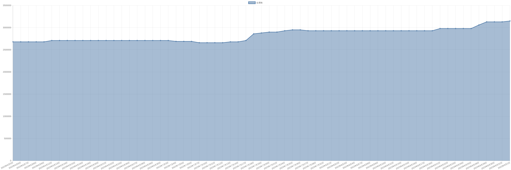

# 金属镝价格变动趋势 

| 时间 | 价格 | 消息正文 |
|:--:|:--:|:--:|
|2023年5月30日|2680000|5月30日金属镝为2680000.00|
|2023年5月29日|2680000|5月29日金属镝为2680000.00|
|2023年5月26日|2680000|5月26日金属镝为2680000.00|
|2023年5月25日|2680000|5月25日金属镝为2680000.00|
|2023年5月24日|2680000|5月24日金属镝为2680000.00|
|2023年5月23日|2680000|5月23日金属镝为2680000.00|
|2023年5月22日|2660000|5月22日金属镝为2660000.00|
|2023年5月19日|2630000|5月19日金属镝为2630000.00|
|2023年5月18日|2630000|5月18日金属镝为2630000.00|
|2023年5月17日|2630000|5月17日金属镝为2630000.00|
|2023年5月16日|2630000|5月16日金属镝为2630000.00|
|2023年5月15日|2630000|5月15日金属镝为2630000.00|
|2023年5月12日|2630000|5月12日金属镝为2630000.00|
|2023年5月11日|2630000|5月11日金属镝为2630000.00|
|2023年5月10日|2630000|5月10日金属镝为2630000.00|
|2023年5月9日|2630000|5月9日金属镝为2630000.00|
|2023年5月8日|2630000|5月8日金属镝为2630000.00|
|2023年5月5日|2630000|5月5日金属镝为2630000.00|
|2023年5月4日|2630000|5月4日金属镝为2630000.00|
|2023年5月3日|2630000|5月3日金属镝为2630000.00|
|2023年5月2日|2630000|5月2日金属镝为2630000.00|
|2023年5月1日|2630000|5月1日金属镝为2630000.00|
|2023年4月28日|2630000|4月28日金属镝为2630000.00|
|2023年4月27日|2630000|4月27日金属镝为2630000.00|
|2023年4月26日|2630000|4月26日金属镝为2630000.00|
|2023年4月25日|2650000|4月25日金属镝为2650000.00|
|2023年4月24日|2650000|4月24日金属镝为2650000.00|
|2023年4月21日|2650000|4月21日金属镝为2650000.00|
|2023年4月20日|2650000|4月20日金属镝为2650000.00|
|2023年4月19日|2650000|4月19日金属镝为2650000.00|
|2023年4月18日|2650000|4月18日金属镝为2650000.00|
|2023年4月17日|2650000|4月17日金属镝为2650000.00|
|2023年4月14日|2660000|4月14日金属镝为2660000.00|
|2023年4月13日|2680000|4月13日金属镝为2680000.00|
|2023年4月12日|2700000|4月12日金属镝为2700000.00|
|2023年4月11日|2720000|4月11日金属镝为2720000.00|
|2023年4月10日|2740000|4月10日金属镝为2740000.00|
|2023年4月7日|2755000|4月7日金属镝为2755000.00|
|2023年4月6日|2785000|4月6日金属镝为2785000.00|
|2023年4月5日|2830000|4月5日金属镝为2830000.00|
|2023年4月4日|2830000|4月4日金属镝为2830000.00|
|2023年4月3日|2830000|4月3日金属镝为2830000.00|
|2023年3月31日|2830000|3月31日金属镝为2830000.00|
|2023年3月30日|2810000|3月30日金属镝为2810000.00|
|2023年3月29日|2780000|3月29日金属镝为2780000.00|
|2023年3月28日|2780000|3月28日金属镝为2780000.00|
|2023年3月27日|2780000|3月27日金属镝为2780000.00|
|2023年3月24日|2780000|3月24日金属镝为2780000.00|
|2023年3月23日|2780000|3月23日金属镝为2780000.00|
|2023年3月22日|2780000|3月22日金属镝为2780000.00|
|2023年3月21日|2780000|3月21日金属镝为2780000.00|
|2023年3月20日|2780000|3月20日金属镝为2780000.00|
|2023年3月17日|2780000|3月17日金属镝为2780000.00|
|2023年3月16日|2780000|3月16日金属镝为2780000.00|
|2023年3月15日|2780000|3月15日金属镝为2780000.00|
|2023年3月14日|2780000|3月14日金属镝为2780000.00|
|2023年3月13日|2780000|3月13日金属镝为2780000.00|
|2023年3月10日|2790000|3月10日金属镝为2790000.00|
|2023年3月9日|2790000|3月9日金属镝为2790000.00|
|2023年3月8日|2790000|3月8日金属镝为2790000.00|
|2023年3月7日|2790000|3月7日金属镝为2790000.00|
|2023年3月6日|2790000|3月6日金属镝为2790000.00|
|2023年3月3日|2810000|3月3日金属镝为2810000.00|
|2023年3月2日|2870000|3月2日金属镝为2870000.00|
|2023年3月1日|2915000|3月1日金属镝为2915000.00|
|2023年2月28日|2965000|2月28日金属镝为2965000.00|
|2023年2月27日|2965000|2月27日金属镝为2965000.00|
|2023年2月24日|2995000|2月24日金属镝为2995000.00|
|2023年2月23日|3005000|2月23日金属镝为3005000.00|