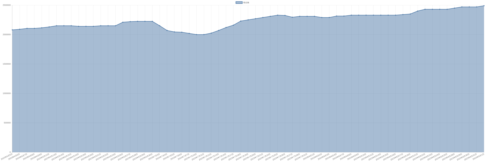

# 氧化镝价格变动趋势 

| 时间 | 价格 | 消息正文 |
|:--:|:--:|:--:|
|2023年6月19日|2140000|6月19日氧化镝为2140000.00|
|2023年6月16日|2140000|6月16日氧化镝为2140000.00|
|2023年6月15日|2150000|6月15日氧化镝为2150000.00|
|2023年6月14日|2150000|6月14日氧化镝为2150000.00|
|2023年6月13日|2150000|6月13日氧化镝为2150000.00|
|2023年6月12日|2130000|6月12日氧化镝为2130000.00|
|2023年6月9日|2115000|6月9日氧化镝为2115000.00|
|2023年6月8日|2105000|6月8日氧化镝为2105000.00|
|2023年6月7日|2105000|6月7日氧化镝为2105000.00|
|2023年6月6日|2090000|6月6日氧化镝为2090000.00|
|2023年6月5日|2080000|6月5日氧化镝为2080000.00|
|2023年6月2日|2080000|6月2日氧化镝为2080000.00|
|2023年6月1日|2105000|6月1日氧化镝为2105000.00|
|2023年5月31日|2115000|5月31日氧化镝为2115000.00|
|2023年5月30日|2130000|5月30日氧化镝为2130000.00|
|2023年5月29日|2130000|5月29日氧化镝为2130000.00|
|2023年5月26日|2130000|5月26日氧化镝为2130000.00|
|2023年5月25日|2130000|5月25日氧化镝为2130000.00|
|2023年5月24日|2130000|5月24日氧化镝为2130000.00|
|2023年5月23日|2130000|5月23日氧化镝为2130000.00|
|2023年5月22日|2085000|5月22日氧化镝为2085000.00|
|2023年5月19日|2055000|5月19日氧化镝为2055000.00|
|2023年5月18日|2035000|5月18日氧化镝为2035000.00|
|2023年5月17日|2025000|5月17日氧化镝为2025000.00|
|2023年5月16日|2010000|5月16日氧化镝为2010000.00|
|2023年5月15日|2010000|5月15日氧化镝为2010000.00|
|2023年5月12日|1985000|5月12日氧化镝为1985000.00|
|2023年5月11日|1985000|5月11日氧化镝为1985000.00|
|2023年5月10日|1945000|5月10日氧化镝为1945000.00|
|2023年5月9日|1920000|5月9日氧化镝为1920000.00|
|2023年5月8日|1910000|5月8日氧化镝为1910000.00|
|2023年5月5日|1905000|5月5日氧化镝为1905000.00|
|2023年5月4日|1905000|5月4日氧化镝为1905000.00|
|2023年5月3日|1905000|5月3日氧化镝为1905000.00|
|2023年5月2日|1905000|5月2日氧化镝为1905000.00|
|2023年5月1日|1905000|5月1日氧化镝为1905000.00|
|2023年4月28日|1905000|4月28日氧化镝为1905000.00|
|2023年4月27日|1925000|4月27日氧化镝为1925000.00|
|2023年4月26日|1930000|4月26日氧化镝为1930000.00|
|2023年4月25日|1940000|4月25日氧化镝为1940000.00|
|2023年4月24日|1940000|4月24日氧化镝为1940000.00|
|2023年4月21日|1940000|4月21日氧化镝为1940000.00|
|2023年4月20日|1910000|4月20日氧化镝为1910000.00|
|2023年4月19日|1875000|4月19日氧化镝为1875000.00|
|2023年4月18日|1875000|4月18日氧化镝为1875000.00|
|2023年4月17日|1875000|4月17日氧化镝为1875000.00|
|2023年4月14日|1885000|4月14日氧化镝为1885000.00|
|2023年4月13日|1925000|4月13日氧化镝为1925000.00|
|2023年4月12日|1940000|4月12日氧化镝为1940000.00|
|2023年4月11日|1965000|4月11日氧化镝为1965000.00|
|2023年4月10日|1985000|4月10日氧化镝为1985000.00|
|2023年4月7日|2015000|4月7日氧化镝为2015000.00|
|2023年4月6日|2040000|4月6日氧化镝为2040000.00|
|2023年4月5日|2055000|4月5日氧化镝为2055000.00|
|2023年4月4日|2055000|4月4日氧化镝为2055000.00|
|2023年4月3日|2075000|4月3日氧化镝为2075000.00|
|2023年3月31日|2075000|3月31日氧化镝为2075000.00|
|2023年3月30日|2040000|3月30日氧化镝为2040000.00|
|2023年3月29日|1995000|3月29日氧化镝为1995000.00|
|2023年3月28日|1995000|3月28日氧化镝为1995000.00|
|2023年3月27日|2005000|3月27日氧化镝为2005000.00|
|2023年3月24日|2005000|3月24日氧化镝为2005000.00|
|2023年3月23日|1985000|3月23日氧化镝为1985000.00|
|2023年3月22日|1985000|3月22日氧化镝为1985000.00|
|2023年3月21日|1975000|3月21日氧化镝为1975000.00|
|2023年3月20日|1955000|3月20日氧化镝为1955000.00|
|2023年3月17日|1955000|3月17日氧化镝为1955000.00|
|2023年3月16日|1955000|3月16日氧化镝为1955000.00|
|2023年3月15日|1955000|3月15日氧化镝为1955000.00|
|2023年3月14日|1970000|3月14日氧化镝为1970000.00|
|2023年3月13日|1970000|3月13日氧化镝为1970000.00|
|2023年3月10日|1975000|3月10日氧化镝为1975000.00|
|2023年3月9日|1975000|3月9日氧化镝为1975000.00|
|2023年3月8日|1975000|3月8日氧化镝为1975000.00|
|2023年3月7日|1970000|3月7日氧化镝为1970000.00|
|2023年3月6日|1975000|3月6日氧化镝为1975000.00|
|2023年3月3日|1990000|3月3日氧化镝为1990000.00|
|2023年3月2日|2045000|3月2日氧化镝为2045000.00|
|2023年3月1日|2095000|3月1日氧化镝为2095000.00|
|2023年2月28日|2160000|2月28日氧化镝为2160000.00|
|2023年2月27日|2170000|2月27日氧化镝为2170000.00|
|2023年2月24日|2190000|2月24日氧化镝为2190000.00|
|2023年2月23日|2210000|2月23日氧化镝为2210000.00|