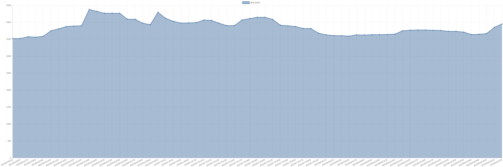

# 液化天然气价格变动趋势 

| 时间 | 价格 | 消息正文 |
|:--:|:--:|:--:|
|2023年6月28日|3974|6月28日液化天然气为3974.00|
|2023年6月27日|4090|6月27日液化天然气为4090.00|
|2023年6月26日|4090|6月26日液化天然气为4090.00|
|2023年6月23日|4266|6月23日液化天然气为4266.00|
|2023年6月22日|4266|6月22日液化天然气为4266.00|
|2023年6月21日|4266|6月21日液化天然气为4266.00|
|2023年6月20日|4322|6月20日液化天然气为4322.00|
|2023年6月19日|4376|6月19日液化天然气为4376.00|
|2023年6月16日|3896|6月16日液化天然气为3896.00|
|2023年6月15日|3890|6月15日液化天然气为3890.00|
|2023年6月14日|3874|6月14日液化天然气为3874.00|
|2023年6月13日|3806|6月13日液化天然气为3806.00|
|2023年6月12日|3750|6月12日液化天然气为3750.00|
|2023年6月9日|3588|6月9日液化天然气为3588.00|
|2023年6月8日|3560|6月8日液化天然气为3560.00|
|2023年6月7日|3574|6月7日液化天然气为3574.00|
|2023年6月6日|3522|6月6日液化天然气为3522.00|
|2023年6月5日|3520|6月5日液化天然气为3520.00|
|2023年6月2日|3684|6月2日液化天然气为3684.00|
|2023年6月1日|3750|6月1日液化天然气为3750.00|
|2023年5月31日|3760|5月31日液化天然气为3760.00|
|2023年5月30日|3728|5月30日液化天然气为3728.00|
|2023年5月29日|3820|5月29日液化天然气为3820.00|
|2023年5月26日|3728|5月26日液化天然气为3728.00|
|2023年5月25日|3688|5月25日液化天然气为3688.00|
|2023年5月24日|3652|5月24日液化天然气为3652.00|
|2023年5月23日|3662|5月23日液化天然气为3662.00|
|2023年5月22日|3708|5月22日液化天然气为3708.00|
|2023年5月19日|3858|5月19日液化天然气为3858.00|
|2023年5月18日|3890|5月18日液化天然气为3890.00|
|2023年5月17日|3956|5月17日液化天然气为3956.00|
|2023年5月16日|3976|5月16日液化天然气为3976.00|
|2023年5月15日|3964|5月15日液化天然气为3964.00|
|2023年5月12日|3982|5月12日液化天然气为3982.00|
|2023年5月11日|3988|5月11日液化天然气为3988.00|
|2023年5月10日|3942|5月10日液化天然气为3942.00|
|2023年5月9日|3948|5月9日液化天然气为3948.00|
|2023年5月8日|4048|5月8日液化天然气为4048.00|
|2023年5月5日|4312|5月5日液化天然气为4312.00|
|2023年5月4日|4398|5月4日液化天然气为4398.00|
|2023年5月3日|4416|5月3日液化天然气为4416.00|
|2023年5月2日|4416|5月2日液化天然气为4416.00|
|2023年5月1日|4416|5月1日液化天然气为4416.00|
|2023年4月28日|4416|4月28日液化天然气为4416.00|
|2023年4月27日|4430|4月27日液化天然气为4430.00|
|2023年4月26日|4386|4月26日液化天然气为4386.00|
|2023年4月25日|4320|4月25日液化天然气为4320.00|
|2023年4月24日|4320|4月24日液化天然气为4320.00|
|2023年4月21日|4694|4月21日液化天然气为4694.00|
|2023年4月20日|4530|4月20日液化天然气为4530.00|
|2023年4月20日|4530|4月20日液化天然气为4530.00|
|2023年4月19日|4298|4月19日液化天然气为4298.00|
|2023年4月18日|4206|4月18日液化天然气为4206.00|
|2023年4月17日|4206|4月17日液化天然气为4206.00|
|2023年4月14日|4250|4月14日液化天然气为4250.00|
|2023年4月13日|4250|4月13日液化天然气为4250.00|
|2023年4月12日|4256|4月12日液化天然气为4256.00|
|2023年4月11日|4198|4月11日液化天然气为4198.00|
|2023年4月10日|4030|4月10日液化天然气为4030.00|
|2023年4月7日|3926|4月7日液化天然气为3926.00|
|2023年4月6日|4006|4月6日液化天然气为4006.00|
|2023年4月5日|4034|4月5日液化天然气为4034.00|
|2023年4月4日|4104|4月4日液化天然气为4104.00|
|2023年4月3日|4150|4月3日液化天然气为4150.00|
|2023年3月31日|4344|3月31日液化天然气为4344.00|
|2023年3月30日|4344|3月30日液化天然气为4344.00|
|2023年3月29日|4318|3月29日液化天然气为4318.00|
|2023年3月28日|4260|3月28日液化天然气为4260.00|
|2023年3月27日|4214|3月27日液化天然气为4214.00|
|2023年3月24日|4254|3月24日液化天然气为4254.00|
|2023年3月23日|4292|3月23日液化天然气为4292.00|
|2023年3月22日|4314|3月22日液化天然气为4314.00|
|2023年3月21日|4374|3月21日液化天然气为4374.00|
|2023年3月20日|4412|3月20日液化天然气为4412.00|
|2023年3月17日|4676|3月17日液化天然气为4676.00|
|2023年3月16日|4608|3月16日液化天然气为4608.00|
|2023年3月15日|4578|3月15日液化天然气为4578.00|
|2023年3月14日|4560|3月14日液化天然气为4560.00|
|2023年3月13日|4646|3月13日液化天然气为4646.00|
|2023年3月10日|5044|3月10日液化天然气为5044.00|
|2023年3月9日|5304|3月9日液化天然气为5304.00|
|2023年3月8日|5472|3月8日液化天然气为5472.00|
|2023年3月7日|5710|3月7日液化天然气为5710.00|
|2023年3月6日|5770|3月6日液化天然气为5770.00|
|2023年3月3日|5950|3月3日液化天然气为5950.00|
|2023年3月2日|5970|3月2日液化天然气为5970.00|
|2023年3月1日|6036|3月1日液化天然气为6036.00|
|2023年2月28日|6082|2月28日液化天然气为6082.00|
|2023年2月27日|6082|2月27日液化天然气为6082.00|
|2023年2月24日|5964|2月24日液化天然气为5964.00|