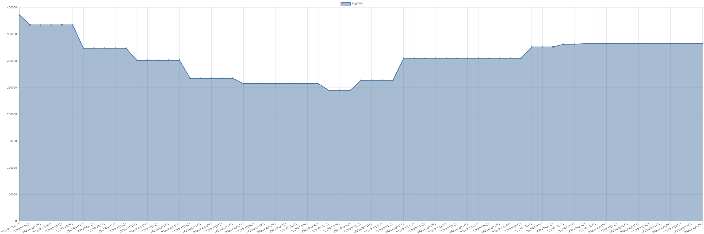

# 氢氧化锂价格变动趋势 

| 时间 | 价格 | 消息正文 |
|:--:|:--:|:--:|
|2023年7月14日|328750|7月14日氢氧化锂为328750.00|
|2023年7月13日|328750|7月13日氢氧化锂为328750.00|
|2023年7月12日|328750|7月12日氢氧化锂为328750.00|
|2023年7月11日|328750|7月11日氢氧化锂为328750.00|
|2023年7月10日|328750|7月10日氢氧化锂为328750.00|
|2023年7月7日|330000|7月7日氢氧化锂为330000.00|
|2023年7月6日|330000|7月6日氢氧化锂为330000.00|
|2023年7月5日|330000|7月5日氢氧化锂为330000.00|
|2023年7月4日|330000|7月4日氢氧化锂为330000.00|
|2023年7月3日|332500|7月3日氢氧化锂为332500.00|
|2023年6月30日|332500|6月30日氢氧化锂为332500.00|
|2023年6月29日|332500|6月29日氢氧化锂为332500.00|
|2023年6月28日|332500|6月28日氢氧化锂为332500.00|
|2023年6月27日|332500|6月27日氢氧化锂为332500.00|
|2023年6月26日|332500|6月26日氢氧化锂为332500.00|
|2023年6月23日|332500|6月23日氢氧化锂为332500.00|
|2023年6月22日|332500|6月22日氢氧化锂为332500.00|
|2023年6月21日|332500|6月21日氢氧化锂为332500.00|
|2023年6月20日|332500|6月20日氢氧化锂为332500.00|
|2023年6月19日|332500|6月19日氢氧化锂为332500.00|
|2023年6月16日|332500|6月16日氢氧化锂为332500.00|
|2023年6月15日|332500|6月15日氢氧化锂为332500.00|
|2023年6月14日|332500|6月14日氢氧化锂为332500.00|
|2023年6月13日|332500|6月13日氢氧化锂为332500.00|
|2023年6月12日|332500|6月12日氢氧化锂为332500.00|
|2023年6月9日|332500|6月9日氢氧化锂为332500.00|
|2023年6月8日|332500|6月8日氢氧化锂为332500.00|
|2023年6月7日|331250|6月7日氢氧化锂为331250.00|
|2023年6月6日|331250|6月6日氢氧化锂为331250.00|
|2023年6月5日|326250|6月5日氢氧化锂为326250.00|
|2023年6月2日|326250|6月2日氢氧化锂为326250.00|
|2023年6月1日|326250|6月1日氢氧化锂为326250.00|
|2023年5月31日|305000|5月31日氢氧化锂为305000.00|
|2023年5月30日|305000|5月30日氢氧化锂为305000.00|
|2023年5月29日|305000|5月29日氢氧化锂为305000.00|
|2023年5月26日|305000|5月26日氢氧化锂为305000.00|
|2023年5月25日|305000|5月25日氢氧化锂为305000.00|
|2023年5月24日|305000|5月24日氢氧化锂为305000.00|
|2023年5月23日|305000|5月23日氢氧化锂为305000.00|
|2023年5月22日|305000|5月22日氢氧化锂为305000.00|
|2023年5月19日|305000|5月19日氢氧化锂为305000.00|
|2023年5月18日|305000|5月18日氢氧化锂为305000.00|
|2023年5月17日|305000|5月17日氢氧化锂为305000.00|
|2023年5月16日|305000|5月16日氢氧化锂为305000.00|
|2023年5月15日|263750|5月15日氢氧化锂为263750.00|
|2023年5月12日|263750|5月12日氢氧化锂为263750.00|
|2023年5月11日|263750|5月11日氢氧化锂为263750.00|
|2023年5月10日|263750|5月10日氢氧化锂为263750.00|
|2023年5月9日|245000|5月9日氢氧化锂为245000.00|
|2023年5月8日|245000|5月8日氢氧化锂为245000.00|
|2023年5月5日|245000|5月5日氢氧化锂为245000.00|
|2023年5月4日|257500|5月4日氢氧化锂为257500.00|
|2023年5月3日|257500|5月3日氢氧化锂为257500.00|
|2023年5月2日|257500|5月2日氢氧化锂为257500.00|
|2023年5月1日|257500|5月1日氢氧化锂为257500.00|
|2023年4月28日|257500|4月28日氢氧化锂为257500.00|
|2023年4月27日|257500|4月27日氢氧化锂为257500.00|
|2023年4月26日|257500|4月26日氢氧化锂为257500.00|
|2023年4月25日|257500|4月25日氢氧化锂为257500.00|
|2023年4月24日|267500|4月24日氢氧化锂为267500.00|
|2023年4月21日|267500|4月21日氢氧化锂为267500.00|
|2023年4月20日|267500|4月20日氢氧化锂为267500.00|
|2023年4月19日|267500|4月19日氢氧化锂为267500.00|
|2023年4月18日|267500|4月18日氢氧化锂为267500.00|
|2023年4月17日|301250|4月17日氢氧化锂为301250.00|
|2023年4月14日|301250|4月14日氢氧化锂为301250.00|
|2023年4月13日|301250|4月13日氢氧化锂为301250.00|
|2023年4月12日|301250|4月12日氢氧化锂为301250.00|
|2023年4月11日|301250|4月11日氢氧化锂为301250.00|
|2023年4月10日|323750|4月10日氢氧化锂为323750.00|
|2023年4月7日|323750|4月7日氢氧化锂为323750.00|
|2023年4月6日|323750|4月6日氢氧化锂为323750.00|
|2023年4月5日|323750|4月5日氢氧化锂为323750.00|
|2023年4月4日|323750|4月4日氢氧化锂为323750.00|
|2023年4月3日|367500|4月3日氢氧化锂为367500.00|
|2023年3月31日|367500|3月31日氢氧化锂为367500.00|
|2023年3月30日|367500|3月30日氢氧化锂为367500.00|
|2023年3月29日|367500|3月29日氢氧化锂为367500.00|
|2023年3月28日|367500|3月28日氢氧化锂为367500.00|
|2023年3月27日|386250|3月27日氢氧化锂为386250.00|
|2023年3月24日|386250|3月24日氢氧化锂为386250.00|
|2023年3月23日|386250|3月23日氢氧化锂为386250.00|
|2023年3月22日|386250|3月22日氢氧化锂为386250.00|
|2023年3月21日|386250|3月21日氢氧化锂为386250.00|
|2023年3月20日|411250|3月20日氢氧化锂为411250.00|
|2023年3月17日|411250|3月17日氢氧化锂为411250.00|
|2023年3月16日|411250|3月16日氢氧化锂为411250.00|
|2023年3月15日|426250|3月15日氢氧化锂为426250.00|
|2023年3月14日|432500|3月14日氢氧化锂为432500.00|
|2023年3月13日|432500|3月13日氢氧化锂为432500.00|
|2023年3月10日|435000|3月10日氢氧化锂为435000.00|
|2023年3月9日|435000|3月9日氢氧化锂为435000.00|
|2023年3月8日|435000|3月8日氢氧化锂为435000.00|
|2023年3月7日|435000|3月7日氢氧化锂为435000.00|
|2023年3月6日|440000|3月6日氢氧化锂为440000.00|
|2023年3月3日|440000|3月3日氢氧化锂为440000.00|
|2023年3月2日|440000|3月2日氢氧化锂为440000.00|
|2023年3月1日|440000|3月1日氢氧化锂为440000.00|
|2023年2月28日|440000|2月28日氢氧化锂为440000.00|
|2023年2月27日|440000|2月27日氢氧化锂为440000.00|
|2023年2月24日|443333.34|2月24日氢氧化锂为443333.34|
|2023年2月23日|443333.34|2月23日氢氧化锂为443333.34|