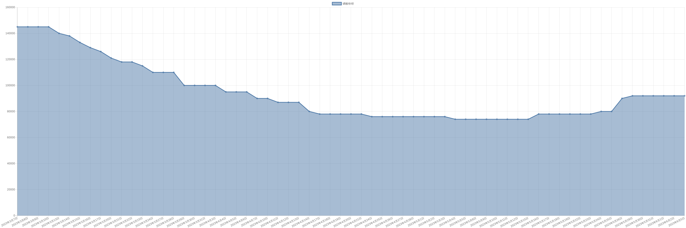

# 磷酸铁锂价格变动趋势 

| 时间 | 价格 | 消息正文 |
|:--:|:--:|:--:|
|2023年8月28日|80000|8月28日磷酸铁锂为80000.00|
|2023年8月25日|89000|8月25日磷酸铁锂为89000.00|
|2023年8月24日|89000|8月24日磷酸铁锂为89000.00|
|2023年8月23日|89000|8月23日磷酸铁锂为89000.00|
|2023年8月22日|89000|8月22日磷酸铁锂为89000.00|
|2023年8月21日|89000|8月21日磷酸铁锂为89000.00|
|2023年8月18日|89000|8月18日磷酸铁锂为89000.00|
|2023年8月17日|89000|8月17日磷酸铁锂为89000.00|
|2023年8月16日|89000|8月16日磷酸铁锂为89000.00|
|2023年8月15日|89000|8月15日磷酸铁锂为89000.00|
|2023年8月14日|89000|8月14日磷酸铁锂为89000.00|
|2023年8月11日|90500|8月11日磷酸铁锂为90500.00|
|2023年8月10日|90500|8月10日磷酸铁锂为90500.00|
|2023年8月9日|90500|8月9日磷酸铁锂为90500.00|
|2023年8月8日|93500|8月8日磷酸铁锂为93500.00|
|2023年8月7日|93500|8月7日磷酸铁锂为93500.00|
|2023年8月4日|93500|8月4日磷酸铁锂为93500.00|
|2023年8月3日|93500|8月3日磷酸铁锂为93500.00|
|2023年8月2日|94500|8月2日磷酸铁锂为94500.00|
|2023年8月1日|94500|8月1日磷酸铁锂为94500.00|
|2023年7月31日|94500|7月31日磷酸铁锂为94500.00|
|2023年7月28日|94500|7月28日磷酸铁锂为94500.00|
|2023年7月27日|94500|7月27日磷酸铁锂为94500.00|
|2023年7月26日|94500|7月26日磷酸铁锂为94500.00|
|2023年7月25日|94500|7月25日磷酸铁锂为94500.00|
|2023年7月24日|94500|7月24日磷酸铁锂为94500.00|
|2023年7月21日|95000|7月21日磷酸铁锂为95000.00|
|2023年7月20日|95000|7月20日磷酸铁锂为95000.00|
|2023年7月19日|95000|7月19日磷酸铁锂为95000.00|
|2023年7月18日|95000|7月18日磷酸铁锂为95000.00|
|2023年7月17日|95000|7月17日磷酸铁锂为95000.00|
|2023年7月14日|95000|7月14日磷酸铁锂为95000.00|
|2023年7月13日|95000|7月13日磷酸铁锂为95000.00|
|2023年7月12日|95000|7月12日磷酸铁锂为95000.00|
|2023年7月11日|95000|7月11日磷酸铁锂为95000.00|
|2023年7月10日|95000|7月10日磷酸铁锂为95000.00|
|2023年7月7日|95000|7月7日磷酸铁锂为95000.00|
|2023年7月6日|95000|7月6日磷酸铁锂为95000.00|
|2023年7月5日|95000|7月5日磷酸铁锂为95000.00|
|2023年7月4日|95000|7月4日磷酸铁锂为95000.00|
|2023年7月3日|95000|7月3日磷酸铁锂为95000.00|
|2023年6月30日|95000|6月30日磷酸铁锂为95000.00|
|2023年6月29日|95000|6月29日磷酸铁锂为95000.00|
|2023年6月28日|94000|6月28日磷酸铁锂为94000.00|
|2023年6月27日|94000|6月27日磷酸铁锂为94000.00|
|2023年6月26日|94000|6月26日磷酸铁锂为94000.00|
|2023年6月23日|94000|6月23日磷酸铁锂为94000.00|
|2023年6月22日|94000|6月22日磷酸铁锂为94000.00|
|2023年6月21日|94000|6月21日磷酸铁锂为94000.00|
|2023年6月20日|94000|6月20日磷酸铁锂为94000.00|
|2023年6月19日|94000|6月19日磷酸铁锂为94000.00|
|2023年6月16日|94000|6月16日磷酸铁锂为94000.00|
|2023年6月15日|94000|6月15日磷酸铁锂为94000.00|
|2023年6月14日|94000|6月14日磷酸铁锂为94000.00|
|2023年6月13日|94000|6月13日磷酸铁锂为94000.00|
|2023年6月12日|94000|6月12日磷酸铁锂为94000.00|
|2023年6月9日|94000|6月9日磷酸铁锂为94000.00|
|2023年6月8日|94000|6月8日磷酸铁锂为94000.00|
|2023年6月7日|92000|6月7日磷酸铁锂为92000.00|
|2023年6月6日|92000|6月6日磷酸铁锂为92000.00|
|2023年6月5日|92000|6月5日磷酸铁锂为92000.00|
|2023年6月2日|92000|6月2日磷酸铁锂为92000.00|
|2023年6月1日|92000|6月1日磷酸铁锂为92000.00|
|2023年5月31日|92000|5月31日磷酸铁锂为92000.00|
|2023年5月30日|92000|5月30日磷酸铁锂为92000.00|
|2023年5月29日|92000|5月29日磷酸铁锂为92000.00|
|2023年5月26日|90000|5月26日磷酸铁锂为90000.00|
|2023年5月25日|80000|5月25日磷酸铁锂为80000.00|
|2023年5月24日|80000|5月24日磷酸铁锂为80000.00|
|2023年5月23日|78000|5月23日磷酸铁锂为78000.00|
|2023年5月22日|78000|5月22日磷酸铁锂为78000.00|
|2023年5月19日|78000|5月19日磷酸铁锂为78000.00|
|2023年5月18日|78000|5月18日磷酸铁锂为78000.00|
|2023年5月17日|78000|5月17日磷酸铁锂为78000.00|
|2023年5月16日|78000|5月16日磷酸铁锂为78000.00|
|2023年5月15日|74000|5月15日磷酸铁锂为74000.00|
|2023年5月12日|74000|5月12日磷酸铁锂为74000.00|
|2023年5月11日|74000|5月11日磷酸铁锂为74000.00|
|2023年5月10日|74000|5月10日磷酸铁锂为74000.00|
|2023年5月9日|74000|5月9日磷酸铁锂为74000.00|
|2023年5月8日|74000|5月8日磷酸铁锂为74000.00|
|2023年5月5日|74000|5月5日磷酸铁锂为74000.00|
|2023年5月4日|74000|5月4日磷酸铁锂为74000.00|
|2023年5月3日|76000|5月3日磷酸铁锂为76000.00|
|2023年5月2日|76000|5月2日磷酸铁锂为76000.00|
|2023年5月1日|76000|5月1日磷酸铁锂为76000.00|
|2023年4月28日|76000|4月28日磷酸铁锂为76000.00|
|2023年4月27日|76000|4月27日磷酸铁锂为76000.00|
|2023年4月26日|76000|4月26日磷酸铁锂为76000.00|
|2023年4月25日|76000|4月25日磷酸铁锂为76000.00|
|2023年4月24日|76000|4月24日磷酸铁锂为76000.00|
|2023年4月21日|78000|4月21日磷酸铁锂为78000.00|
|2023年4月20日|78000|4月20日磷酸铁锂为78000.00|
|2023年4月19日|78000|4月19日磷酸铁锂为78000.00|
|2023年4月18日|78000|4月18日磷酸铁锂为78000.00|
|2023年4月17日|78000|4月17日磷酸铁锂为78000.00|
|2023年4月14日|80000|4月14日磷酸铁锂为80000.00|
|2023年4月13日|87000|4月13日磷酸铁锂为87000.00|
|2023年4月12日|87000|4月12日磷酸铁锂为87000.00|
|2023年4月11日|87000|4月11日磷酸铁锂为87000.00|
|2023年4月10日|90000|4月10日磷酸铁锂为90000.00|
|2023年4月7日|90000|4月7日磷酸铁锂为90000.00|
|2023年4月6日|95000|4月6日磷酸铁锂为95000.00|
|2023年4月5日|95000|4月5日磷酸铁锂为95000.00|
|2023年4月4日|95000|4月4日磷酸铁锂为95000.00|
|2023年4月3日|100000|4月3日磷酸铁锂为100000.00|
|2023年3月31日|100000|3月31日磷酸铁锂为100000.00|
|2023年3月30日|100000|3月30日磷酸铁锂为100000.00|
|2023年3月29日|100000|3月29日磷酸铁锂为100000.00|
|2023年3月28日|110000|3月28日磷酸铁锂为110000.00|
|2023年3月27日|110000|3月27日磷酸铁锂为110000.00|
|2023年3月24日|110000|3月24日磷酸铁锂为110000.00|
|2023年3月23日|115000|3月23日磷酸铁锂为115000.00|
|2023年3月22日|118000|3月22日磷酸铁锂为118000.00|
|2023年3月21日|118000|3月21日磷酸铁锂为118000.00|
|2023年3月20日|121000|3月20日磷酸铁锂为121000.00|
|2023年3月17日|126000|3月17日磷酸铁锂为126000.00|
|2023年3月16日|129000|3月16日磷酸铁锂为129000.00|
|2023年3月15日|133000|3月15日磷酸铁锂为133000.00|
|2023年3月14日|138000|3月14日磷酸铁锂为138000.00|
|2023年3月13日|140000|3月13日磷酸铁锂为140000.00|
|2023年3月10日|145000|3月10日磷酸铁锂为145000.00|
|2023年3月9日|145000|3月9日磷酸铁锂为145000.00|
|2023年3月8日|145000|3月8日磷酸铁锂为145000.00|
|2023年3月7日|145000|3月7日磷酸铁锂为145000.00|
|2023年3月6日|145000|3月6日磷酸铁锂为145000.00|
|2023年3月3日|145000|3月3日磷酸铁锂为145000.00|
|2023年3月2日|145000|3月2日磷酸铁锂为145000.00|
|2023年3月1日|145000|3月1日磷酸铁锂为145000.00|
|2023年2月28日|145000|2月28日磷酸铁锂为145000.00|
|2023年2月27日|145000|2月27日磷酸铁锂为145000.00|
|2023年2月24日|145000|2月24日磷酸铁锂为145000.00|
|2023年2月23日|145000|2月23日磷酸铁锂为145000.00|