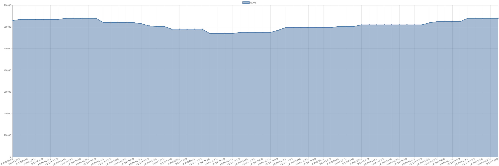

# 金属钕价格变动趋势 

| 时间 | 价格 | 消息正文 |
|:--:|:--:|:--:|
|2023年7月14日|570000|7月14日金属钕为570000.00|
|2023年7月13日|570000|7月13日金属钕为570000.00|
|2023年7月12日|570000|7月12日金属钕为570000.00|
|2023年7月11日|570000|7月11日金属钕为570000.00|
|2023年7月10日|590000|7月10日金属钕为590000.00|
|2023年7月7日|590000|7月7日金属钕为590000.00|
|2023年7月6日|590000|7月6日金属钕为590000.00|
|2023年7月5日|590000|7月5日金属钕为590000.00|
|2023年7月4日|590000|7月4日金属钕为590000.00|
|2023年7月3日|602500|7月3日金属钕为602500.00|
|2023年6月30日|602500|6月30日金属钕为602500.00|
|2023年6月29日|605000|6月29日金属钕为605000.00|
|2023年6月28日|615000|6月28日金属钕为615000.00|
|2023年6月27日|620000|6月27日金属钕为620000.00|
|2023年6月26日|620000|6月26日金属钕为620000.00|
|2023年6月23日|620000|6月23日金属钕为620000.00|
|2023年6月22日|620000|6月22日金属钕为620000.00|
|2023年6月21日|620000|6月21日金属钕为620000.00|
|2023年6月20日|640000|6月20日金属钕为640000.00|
|2023年6月19日|640000|6月19日金属钕为640000.00|
|2023年6月16日|640000|6月16日金属钕为640000.00|
|2023年6月15日|640000|6月15日金属钕为640000.00|
|2023年6月14日|640000|6月14日金属钕为640000.00|
|2023年6月13日|635000|6月13日金属钕为635000.00|
|2023年6月12日|635000|6月12日金属钕为635000.00|
|2023年6月9日|635000|6月9日金属钕为635000.00|
|2023年6月8日|635000|6月8日金属钕为635000.00|
|2023年6月7日|635000|6月7日金属钕为635000.00|
|2023年6月6日|635000|6月6日金属钕为635000.00|
|2023年6月5日|630000|6月5日金属钕为630000.00|
|2023年6月2日|630000|6月2日金属钕为630000.00|
|2023年6月1日|640000|6月1日金属钕为640000.00|
|2023年5月31日|640000|5月31日金属钕为640000.00|
|2023年5月30日|640000|5月30日金属钕为640000.00|
|2023年5月29日|630000|5月29日金属钕为630000.00|
|2023年5月26日|620000|5月26日金属钕为620000.00|
|2023年5月25日|620000|5月25日金属钕为620000.00|
|2023年5月24日|620000|5月24日金属钕为620000.00|
|2023年5月23日|620000|5月23日金属钕为620000.00|
|2023年5月22日|600000|5月22日金属钕为600000.00|
|2023年5月19日|600000|5月19日金属钕为600000.00|
|2023年5月18日|600000|5月18日金属钕为600000.00|
|2023年5月17日|600000|5月17日金属钕为600000.00|
|2023年5月16日|600000|5月16日金属钕为600000.00|
|2023年5月15日|600000|5月15日金属钕为600000.00|
|2023年5月12日|600000|5月12日金属钕为600000.00|
|2023年5月11日|600000|5月11日金属钕为600000.00|
|2023年5月10日|600000|5月10日金属钕为600000.00|
|2023年5月9日|600000|5月9日金属钕为600000.00|
|2023年5月8日|600000|5月8日金属钕为600000.00|
|2023年5月5日|600000|5月5日金属钕为600000.00|
|2023年5月4日|600000|5月4日金属钕为600000.00|
|2023年5月3日|600000|5月3日金属钕为600000.00|
|2023年5月2日|600000|5月2日金属钕为600000.00|
|2023年5月1日|600000|5月1日金属钕为600000.00|
|2023年4月28日|600000|4月28日金属钕为600000.00|
|2023年4月27日|600000|4月27日金属钕为600000.00|
|2023年4月26日|610000|4月26日金属钕为610000.00|
|2023年4月25日|615000|4月25日金属钕为615000.00|
|2023年4月24日|620000|4月24日金属钕为620000.00|
|2023年4月21日|647500|4月21日金属钕为647500.00|
|2023年4月20日|647500|4月20日金属钕为647500.00|
|2023年4月19日|647500|4月19日金属钕为647500.00|
|2023年4月18日|660000|4月18日金属钕为660000.00|
|2023年4月17日|660000|4月17日金属钕为660000.00|
|2023年4月14日|670000|4月14日金属钕为670000.00|
|2023年4月13日|680000|4月13日金属钕为680000.00|
|2023年4月12日|695000|4月12日金属钕为695000.00|
|2023年4月11日|695000|4月11日金属钕为695000.00|
|2023年4月10日|705000|4月10日金属钕为705000.00|
|2023年4月7日|705000|4月7日金属钕为705000.00|
|2023年4月6日|715000|4月6日金属钕为715000.00|
|2023年4月5日|715000|4月5日金属钕为715000.00|
|2023年4月4日|715000|4月4日金属钕为715000.00|
|2023年4月3日|715000|4月3日金属钕为715000.00|
|2023年3月31日|715000|3月31日金属钕为715000.00|
|2023年3月30日|715000|3月30日金属钕为715000.00|
|2023年3月29日|725000|3月29日金属钕为725000.00|
|2023年3月28日|735000|3月28日金属钕为735000.00|
|2023年3月27日|735000|3月27日金属钕为735000.00|
|2023年3月24日|745000|3月24日金属钕为745000.00|
|2023年3月23日|755000|3月23日金属钕为755000.00|
|2023年3月22日|755000|3月22日金属钕为755000.00|
|2023年3月21日|755000|3月21日金属钕为755000.00|
|2023年3月20日|755000|3月20日金属钕为755000.00|
|2023年3月17日|755000|3月17日金属钕为755000.00|
|2023年3月16日|755000|3月16日金属钕为755000.00|
|2023年3月15日|755000|3月15日金属钕为755000.00|
|2023年3月14日|780000|3月14日金属钕为780000.00|
|2023年3月13日|800000|3月13日金属钕为800000.00|
|2023年3月10日|810000|3月10日金属钕为810000.00|
|2023年3月9日|810000|3月9日金属钕为810000.00|
|2023年3月8日|815000|3月8日金属钕为815000.00|
|2023年3月7日|815000|3月7日金属钕为815000.00|
|2023年3月6日|825000|3月6日金属钕为825000.00|
|2023年3月3日|865000|3月3日金属钕为865000.00|
|2023年3月2日|885000|3月2日金属钕为885000.00|
|2023年3月1日|895000|3月1日金属钕为895000.00|
|2023年2月28日|895000|2月28日金属钕为895000.00|
|2023年2月27日|895000|2月27日金属钕为895000.00|
|2023年2月24日|905000|2月24日金属钕为905000.00|
|2023年2月23日|910000|2月23日金属钕为910000.00|
|2023年2月22日|915000|2月22日金属钕为915000.00|
|2023年2月21日|925000|2月21日金属钕为925000.00|
|2023年2月20日|940000|2月20日金属钕为940000.00|
|2023年2月17日|940000|2月17日金属钕为940000.00|
|2023年2月16日|940000|2月16日金属钕为940000.00|
|2023年2月15日|955000|2月15日金属钕为955000.00|
|2023年2月14日|955000|2月14日金属钕为955000.00|
|2023年2月13日|965000|2月13日金属钕为965000.00|
|2023年2月10日|965000|2月10日金属钕为965000.00|
|2023年2月9日|975000|2月9日金属钕为975000.00|
|2023年2月8日|985000|2月8日金属钕为985000.00|