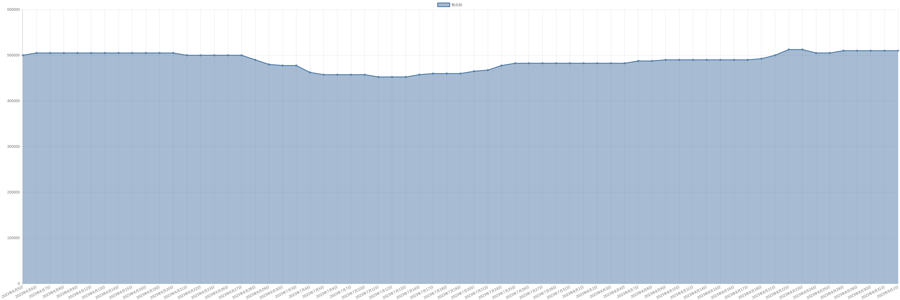

# 氧化钕价格变动趋势 

| 时间 | 价格 | 消息正文 |
|:--:|:--:|:--:|
|2023年6月13日|505000|6月13日氧化钕为505000.00|
|2023年6月12日|505000|6月12日氧化钕为505000.00|
|2023年6月9日|505000|6月9日氧化钕为505000.00|
|2023年6月8日|505000|6月8日氧化钕为505000.00|
|2023年6月7日|505000|6月7日氧化钕为505000.00|
|2023年6月6日|505000|6月6日氧化钕为505000.00|
|2023年6月5日|500000|6月5日氧化钕为500000.00|
|2023年6月2日|500000|6月2日氧化钕为500000.00|
|2023年6月1日|505000|6月1日氧化钕为505000.00|
|2023年5月31日|510000|5月31日氧化钕为510000.00|
|2023年5月30日|520000|5月30日氧化钕为520000.00|
|2023年5月29日|500000|5月29日氧化钕为500000.00|
|2023年5月26日|487500|5月26日氧化钕为487500.00|
|2023年5月25日|482500|5月25日氧化钕为482500.00|
|2023年5月24日|482500|5月24日氧化钕为482500.00|
|2023年5月23日|482500|5月23日氧化钕为482500.00|
|2023年5月22日|462500|5月22日氧化钕为462500.00|
|2023年5月19日|455000|5月19日氧化钕为455000.00|
|2023年5月18日|455000|5月18日氧化钕为455000.00|
|2023年5月17日|455000|5月17日氧化钕为455000.00|
|2023年5月16日|455000|5月16日氧化钕为455000.00|
|2023年5月15日|455000|5月15日氧化钕为455000.00|
|2023年5月12日|455000|5月12日氧化钕为455000.00|
|2023年5月11日|455000|5月11日氧化钕为455000.00|
|2023年5月10日|455000|5月10日氧化钕为455000.00|
|2023年5月9日|455000|5月9日氧化钕为455000.00|
|2023年5月8日|445000|5月8日氧化钕为445000.00|
|2023年5月5日|455000|5月5日氧化钕为455000.00|
|2023年5月4日|455000|5月4日氧化钕为455000.00|
|2023年5月3日|455000|5月3日氧化钕为455000.00|
|2023年5月2日|455000|5月2日氧化钕为455000.00|
|2023年5月1日|455000|5月1日氧化钕为455000.00|
|2023年4月28日|455000|4月28日氧化钕为455000.00|
|2023年4月27日|455000|4月27日氧化钕为455000.00|
|2023年4月26日|465000|4月26日氧化钕为465000.00|
|2023年4月25日|480000|4月25日氧化钕为480000.00|
|2023年4月24日|480000|4月24日氧化钕为480000.00|
|2023年4月21日|482500|4月21日氧化钕为482500.00|
|2023年4月20日|482500|4月20日氧化钕为482500.00|
|2023年4月19日|482500|4月19日氧化钕为482500.00|
|2023年4月18日|495000|4月18日氧化钕为495000.00|
|2023年4月17日|495000|4月17日氧化钕为495000.00|
|2023年4月14日|500000|4月14日氧化钕为500000.00|
|2023年4月13日|517500|4月13日氧化钕为517500.00|
|2023年4月12日|522500|4月12日氧化钕为522500.00|
|2023年4月11日|522500|4月11日氧化钕为522500.00|
|2023年4月10日|545000|4月10日氧化钕为545000.00|
|2023年4月7日|545000|4月7日氧化钕为545000.00|
|2023年4月6日|555000|4月6日氧化钕为555000.00|
|2023年4月5日|555000|4月5日氧化钕为555000.00|
|2023年4月4日|555000|4月4日氧化钕为555000.00|
|2023年4月3日|555000|4月3日氧化钕为555000.00|
|2023年3月31日|555000|3月31日氧化钕为555000.00|
|2023年3月30日|555000|3月30日氧化钕为555000.00|
|2023年3月29日|565000|3月29日氧化钕为565000.00|
|2023年3月28日|575000|3月28日氧化钕为575000.00|
|2023年3月27日|585000|3月27日氧化钕为585000.00|
|2023年3月24日|595000|3月24日氧化钕为595000.00|
|2023年3月23日|605000|3月23日氧化钕为605000.00|
|2023年3月22日|605000|3月22日氧化钕为605000.00|
|2023年3月21日|605000|3月21日氧化钕为605000.00|
|2023年3月20日|605000|3月20日氧化钕为605000.00|
|2023年3月17日|605000|3月17日氧化钕为605000.00|
|2023年3月16日|615000|3月16日氧化钕为615000.00|
|2023年3月15日|615000|3月15日氧化钕为615000.00|
|2023年3月14日|630000|3月14日氧化钕为630000.00|
|2023年3月13日|645000|3月13日氧化钕为645000.00|
|2023年3月10日|650000|3月10日氧化钕为650000.00|
|2023年3月9日|650000|3月9日氧化钕为650000.00|
|2023年3月8日|655000|3月8日氧化钕为655000.00|
|2023年3月7日|655000|3月7日氧化钕为655000.00|
|2023年3月6日|665000|3月6日氧化钕为665000.00|
|2023年3月3日|685000|3月3日氧化钕为685000.00|
|2023年3月2日|695000|3月2日氧化钕为695000.00|
|2023年3月1日|705000|3月1日氧化钕为705000.00|
|2023年2月28日|705000|2月28日氧化钕为705000.00|
|2023年2月27日|705000|2月27日氧化钕为705000.00|
|2023年2月24日|725000|2月24日氧化钕为725000.00|
|2023年2月23日|730000|2月23日氧化钕为730000.00|