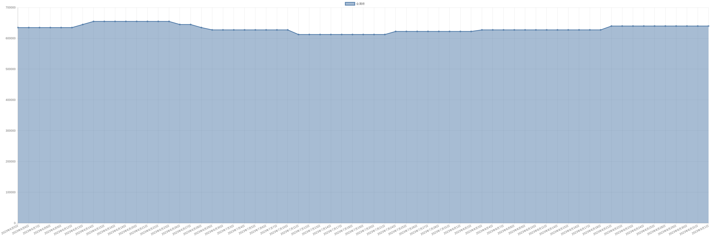

# 金属镨价格变动趋势 

| 时间 | 价格 | 消息正文 |
|:--:|:--:|:--:|
|2023年7月14日|612500|7月14日金属镨为612500.00|
|2023年7月13日|612500|7月13日金属镨为612500.00|
|2023年7月12日|612500|7月12日金属镨为612500.00|
|2023年7月11日|612500|7月11日金属镨为612500.00|
|2023年7月10日|627500|7月10日金属镨为627500.00|
|2023年7月7日|627500|7月7日金属镨为627500.00|
|2023年7月6日|627500|7月6日金属镨为627500.00|
|2023年7月5日|627500|7月5日金属镨为627500.00|
|2023年7月4日|627500|7月4日金属镨为627500.00|
|2023年7月3日|627500|7月3日金属镨为627500.00|
|2023年6月30日|627500|6月30日金属镨为627500.00|
|2023年6月29日|627500|6月29日金属镨为627500.00|
|2023年6月28日|635000|6月28日金属镨为635000.00|
|2023年6月27日|645000|6月27日金属镨为645000.00|
|2023年6月26日|645000|6月26日金属镨为645000.00|
|2023年6月23日|655000|6月23日金属镨为655000.00|
|2023年6月22日|655000|6月22日金属镨为655000.00|
|2023年6月21日|655000|6月21日金属镨为655000.00|
|2023年6月20日|655000|6月20日金属镨为655000.00|
|2023年6月19日|655000|6月19日金属镨为655000.00|
|2023年6月16日|655000|6月16日金属镨为655000.00|
|2023年6月15日|655000|6月15日金属镨为655000.00|
|2023年6月14日|655000|6月14日金属镨为655000.00|
|2023年6月13日|645000|6月13日金属镨为645000.00|
|2023年6月12日|635000|6月12日金属镨为635000.00|
|2023年6月9日|635000|6月9日金属镨为635000.00|
|2023年6月8日|635000|6月8日金属镨为635000.00|
|2023年6月7日|635000|6月7日金属镨为635000.00|
|2023年6月6日|635000|6月6日金属镨为635000.00|
|2023年6月5日|635000|6月5日金属镨为635000.00|
|2023年6月2日|635000|6月2日金属镨为635000.00|
|2023年6月1日|635000|6月1日金属镨为635000.00|
|2023年5月31日|635000|5月31日金属镨为635000.00|
|2023年5月30日|635000|5月30日金属镨为635000.00|
|2023年5月29日|635000|5月29日金属镨为635000.00|
|2023年5月26日|625000|5月26日金属镨为625000.00|
|2023年5月25日|625000|5月25日金属镨为625000.00|
|2023年5月24日|625000|5月24日金属镨为625000.00|
|2023年5月23日|625000|5月23日金属镨为625000.00|
|2023年5月22日|595000|5月22日金属镨为595000.00|
|2023年5月19日|595000|5月19日金属镨为595000.00|
|2023年5月18日|595000|5月18日金属镨为595000.00|
|2023年5月17日|595000|5月17日金属镨为595000.00|
|2023年5月16日|595000|5月16日金属镨为595000.00|
|2023年5月15日|585000|5月15日金属镨为585000.00|
|2023年5月12日|585000|5月12日金属镨为585000.00|
|2023年5月11日|585000|5月11日金属镨为585000.00|
|2023年5月10日|585000|5月10日金属镨为585000.00|
|2023年5月9日|585000|5月9日金属镨为585000.00|
|2023年5月8日|570000|5月8日金属镨为570000.00|
|2023年5月5日|610000|5月5日金属镨为610000.00|
|2023年5月4日|610000|5月4日金属镨为610000.00|
|2023年5月3日|610000|5月3日金属镨为610000.00|
|2023年5月2日|610000|5月2日金属镨为610000.00|
|2023年5月1日|610000|5月1日金属镨为610000.00|
|2023年4月28日|610000|4月28日金属镨为610000.00|
|2023年4月27日|610000|4月27日金属镨为610000.00|
|2023年4月26日|610000|4月26日金属镨为610000.00|
|2023年4月25日|625000|4月25日金属镨为625000.00|
|2023年4月24日|645000|4月24日金属镨为645000.00|
|2023年4月21日|645000|4月21日金属镨为645000.00|
|2023年4月20日|645000|4月20日金属镨为645000.00|
|2023年4月19日|645000|4月19日金属镨为645000.00|
|2023年4月18日|675000|4月18日金属镨为675000.00|
|2023年4月17日|675000|4月17日金属镨为675000.00|
|2023年4月14日|675000|4月14日金属镨为675000.00|
|2023年4月13日|685000|4月13日金属镨为685000.00|
|2023年4月12日|685000|4月12日金属镨为685000.00|
|2023年4月11日|685000|4月11日金属镨为685000.00|
|2023年4月10日|695000|4月10日金属镨为695000.00|
|2023年4月7日|695000|4月7日金属镨为695000.00|
|2023年4月6日|695000|4月6日金属镨为695000.00|
|2023年4月5日|695000|4月5日金属镨为695000.00|
|2023年4月4日|695000|4月4日金属镨为695000.00|
|2023年4月3日|695000|4月3日金属镨为695000.00|
|2023年3月31日|695000|3月31日金属镨为695000.00|
|2023年3月30日|695000|3月30日金属镨为695000.00|
|2023年3月29日|705000|3月29日金属镨为705000.00|
|2023年3月28日|705000|3月28日金属镨为705000.00|
|2023年3月27日|717500|3月27日金属镨为717500.00|
|2023年3月24日|742500|3月24日金属镨为742500.00|
|2023年3月23日|775000|3月23日金属镨为775000.00|
|2023年3月22日|775000|3月22日金属镨为775000.00|
|2023年3月21日|775000|3月21日金属镨为775000.00|
|2023年3月20日|775000|3月20日金属镨为775000.00|
|2023年3月17日|775000|3月17日金属镨为775000.00|
|2023年3月16日|775000|3月16日金属镨为775000.00|
|2023年3月15日|775000|3月15日金属镨为775000.00|
|2023年3月14日|785000|3月14日金属镨为785000.00|
|2023年3月13日|810000|3月13日金属镨为810000.00|
|2023年3月10日|810000|3月10日金属镨为810000.00|
|2023年3月9日|810000|3月9日金属镨为810000.00|
|2023年3月8日|820000|3月8日金属镨为820000.00|
|2023年3月7日|820000|3月7日金属镨为820000.00|
|2023年3月6日|840000|3月6日金属镨为840000.00|
|2023年3月3日|880000|3月3日金属镨为880000.00|
|2023年3月2日|880000|3月2日金属镨为880000.00|
|2023年3月1日|890000|3月1日金属镨为890000.00|
|2023年2月28日|890000|2月28日金属镨为890000.00|
|2023年2月27日|890000|2月27日金属镨为890000.00|
|2023年2月24日|890000|2月24日金属镨为890000.00|
|2023年2月23日|890000|2月23日金属镨为890000.00|
|2023年2月22日|890000|2月22日金属镨为890000.00|
|2023年2月21日|890000|2月21日金属镨为890000.00|
|2023年2月20日|890000|2月20日金属镨为890000.00|
|2023年2月17日|890000|2月17日金属镨为890000.00|
|2023年2月16日|890000|2月16日金属镨为890000.00|
|2023年2月15日|895000|2月15日金属镨为895000.00|
|2023年2月14日|915000|2月14日金属镨为915000.00|
|2023年2月13日|915000|2月13日金属镨为915000.00|
|2023年2月10日|915000|2月10日金属镨为915000.00|
|2023年2月9日|925000|2月9日金属镨为925000.00|
|2023年2月8日|935000|2月8日金属镨为935000.00|