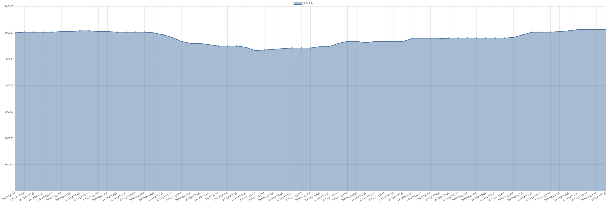

# 镨钕合金价格变动趋势 

| 时间 | 价格 | 消息正文 |
|:--:|:--:|:--:|
|2023年8月28日|607500|8月28日镨钕合金为607500.00|
|2023年8月25日|605000|8月25日镨钕合金为605000.00|
|2023年8月24日|602500|8月24日镨钕合金为602500.00|
|2023年8月23日|602500|8月23日镨钕合金为602500.00|
|2023年8月22日|602500|8月22日镨钕合金为602500.00|
|2023年8月21日|592500|8月21日镨钕合金为592500.00|
|2023年8月18日|582500|8月18日镨钕合金为582500.00|
|2023年8月17日|580000|8月17日镨钕合金为580000.00|
|2023年8月16日|580000|8月16日镨钕合金为580000.00|
|2023年8月15日|580000|8月15日镨钕合金为580000.00|
|2023年8月14日|580000|8月14日镨钕合金为580000.00|
|2023年8月11日|580000|8月11日镨钕合金为580000.00|
|2023年8月10日|580000|8月10日镨钕合金为580000.00|
|2023年8月9日|580000|8月9日镨钕合金为580000.00|
|2023年8月8日|577500|8月8日镨钕合金为577500.00|
|2023年8月7日|577500|8月7日镨钕合金为577500.00|
|2023年8月4日|577500|8月4日镨钕合金为577500.00|
|2023年8月3日|577500|8月3日镨钕合金为577500.00|
|2023年8月2日|567500|8月2日镨钕合金为567500.00|
|2023年8月1日|567500|8月1日镨钕合金为567500.00|
|2023年7月31日|567500|7月31日镨钕合金为567500.00|
|2023年7月28日|567500|7月28日镨钕合金为567500.00|
|2023年7月27日|562500|7月27日镨钕合金为562500.00|
|2023年7月26日|567500|7月26日镨钕合金为567500.00|
|2023年7月25日|567500|7月25日镨钕合金为567500.00|
|2023年7月24日|560000|7月24日镨钕合金为560000.00|
|2023年7月21日|547500|7月21日镨钕合金为547500.00|
|2023年7月20日|547500|7月20日镨钕合金为547500.00|
|2023年7月19日|542500|7月19日镨钕合金为542500.00|
|2023年7月18日|542500|7月18日镨钕合金为542500.00|
|2023年7月17日|542500|7月17日镨钕合金为542500.00|
|2023年7月14日|540000|7月14日镨钕合金为540000.00|
|2023年7月13日|537500|7月13日镨钕合金为537500.00|
|2023年7月12日|535000|7月12日镨钕合金为535000.00|
|2023年7月11日|532500|7月11日镨钕合金为532500.00|
|2023年7月10日|545000|7月10日镨钕合金为545000.00|
|2023年7月7日|550000|7月7日镨钕合金为550000.00|
|2023年7月6日|550000|7月6日镨钕合金为550000.00|
|2023年7月5日|550000|7月5日镨钕合金为550000.00|
|2023年7月4日|555000|7月4日镨钕合金为555000.00|
|2023年7月3日|560000|7月3日镨钕合金为560000.00|
|2023年6月30日|560000|6月30日镨钕合金为560000.00|
|2023年6月29日|567500|6月29日镨钕合金为567500.00|
|2023年6月28日|582500|6月28日镨钕合金为582500.00|
|2023年6月27日|592500|6月27日镨钕合金为592500.00|
|2023年6月26日|600000|6月26日镨钕合金为600000.00|
|2023年6月23日|602500|6月23日镨钕合金为602500.00|
|2023年6月22日|602500|6月22日镨钕合金为602500.00|
|2023年6月21日|602500|6月21日镨钕合金为602500.00|
|2023年6月20日|602500|6月20日镨钕合金为602500.00|
|2023年6月19日|605000|6月19日镨钕合金为605000.00|
|2023年6月16日|605000|6月16日镨钕合金为605000.00|
|2023年6月15日|607500|6月15日镨钕合金为607500.00|
|2023年6月14日|607500|6月14日镨钕合金为607500.00|
|2023年6月13日|605000|6月13日镨钕合金为605000.00|
|2023年6月12日|605000|6月12日镨钕合金为605000.00|
|2023年6月9日|602500|6月9日镨钕合金为602500.00|
|2023年6月8日|602500|6月8日镨钕合金为602500.00|
|2023年6月7日|602500|6月7日镨钕合金为602500.00|
|2023年6月6日|602500|6月6日镨钕合金为602500.00|
|2023年6月5日|600000|6月5日镨钕合金为600000.00|
|2023年6月2日|600000|6月2日镨钕合金为600000.00|
|2023年6月1日|605000|6月1日镨钕合金为605000.00|
|2023年5月31日|610000|5月31日镨钕合金为610000.00|
|2023年5月30日|615000|5月30日镨钕合金为615000.00|
|2023年5月29日|600000|5月29日镨钕合金为600000.00|
|2023年5月26日|582500|5月26日镨钕合金为582500.00|
|2023年5月25日|577500|5月25日镨钕合金为577500.00|
|2023年5月24日|577500|5月24日镨钕合金为577500.00|
|2023年5月23日|577500|5月23日镨钕合金为577500.00|
|2023年5月22日|567500|5月22日镨钕合金为567500.00|
|2023年5月19日|565000|5月19日镨钕合金为565000.00|
|2023年5月18日|567500|5月18日镨钕合金为567500.00|
|2023年5月17日|567500|5月17日镨钕合金为567500.00|
|2023年5月16日|560000|5月16日镨钕合金为560000.00|
|2023年5月15日|552500|5月15日镨钕合金为552500.00|
|2023年5月12日|552500|5月12日镨钕合金为552500.00|
|2023年5月11日|555000|5月11日镨钕合金为555000.00|
|2023年5月10日|555000|5月10日镨钕合金为555000.00|
|2023年5月9日|555000|5月9日镨钕合金为555000.00|
|2023年5月8日|542500|5月8日镨钕合金为542500.00|
|2023年5月5日|540000|5月5日镨钕合金为540000.00|
|2023年5月4日|540000|5月4日镨钕合金为540000.00|
|2023年5月3日|540000|5月3日镨钕合金为540000.00|
|2023年5月2日|540000|5月2日镨钕合金为540000.00|
|2023年5月1日|540000|5月1日镨钕合金为540000.00|
|2023年4月28日|540000|4月28日镨钕合金为540000.00|
|2023年4月27日|550000|4月27日镨钕合金为550000.00|
|2023年4月26日|552500|4月26日镨钕合金为552500.00|
|2023年4月25日|560000|4月25日镨钕合金为560000.00|
|2023年4月24日|570000|4月24日镨钕合金为570000.00|
|2023年4月21日|575000|4月21日镨钕合金为575000.00|
|2023年4月20日|575000|4月20日镨钕合金为575000.00|
|2023年4月19日|575000|4月19日镨钕合金为575000.00|
|2023年4月18日|577500|4月18日镨钕合金为577500.00|
|2023年4月17日|585000|4月17日镨钕合金为585000.00|
|2023年4月14日|587500|4月14日镨钕合金为587500.00|
|2023年4月13日|605000|4月13日镨钕合金为605000.00|
|2023年4月12日|610000|4月12日镨钕合金为610000.00|
|2023年4月11日|620000|4月11日镨钕合金为620000.00|
|2023年4月10日|625000|4月10日镨钕合金为625000.00|
|2023年4月7日|635000|4月7日镨钕合金为635000.00|
|2023年4月6日|637500|4月6日镨钕合金为637500.00|
|2023年4月5日|637500|4月5日镨钕合金为637500.00|
|2023年4月4日|637500|4月4日镨钕合金为637500.00|
|2023年4月3日|627500|4月3日镨钕合金为627500.00|
|2023年3月31日|627500|3月31日镨钕合金为627500.00|
|2023年3月30日|637500|3月30日镨钕合金为637500.00|
|2023年3月29日|650000|3月29日镨钕合金为650000.00|
|2023年3月28日|665000|3月28日镨钕合金为665000.00|
|2023年3月27日|675000|3月27日镨钕合金为675000.00|
|2023年3月24日|680000|3月24日镨钕合金为680000.00|
|2023年3月23日|680000|3月23日镨钕合金为680000.00|
|2023年3月22日|680000|3月22日镨钕合金为680000.00|
|2023年3月21日|677500|3月21日镨钕合金为677500.00|
|2023年3月20日|670000|3月20日镨钕合金为670000.00|
|2023年3月17日|670000|3月17日镨钕合金为670000.00|
|2023年3月16日|675000|3月16日镨钕合金为675000.00|
|2023年3月15日|675000|3月15日镨钕合金为675000.00|
|2023年3月14日|705000|3月14日镨钕合金为705000.00|
|2023年3月13日|715000|3月13日镨钕合金为715000.00|
|2023年3月10日|750000|3月10日镨钕合金为750000.00|
|2023年3月9日|750000|3月9日镨钕合金为750000.00|
|2023年3月8日|755000|3月8日镨钕合金为755000.00|
|2023年3月7日|755000|3月7日镨钕合金为755000.00|
|2023年3月6日|770000|3月6日镨钕合金为770000.00|
|2023年3月3日|780000|3月3日镨钕合金为780000.00|
|2023年3月2日|802500|3月2日镨钕合金为802500.00|
|2023年3月1日|815000|3月1日镨钕合金为815000.00|
|2023年2月28日|820000|2月28日镨钕合金为820000.00|
|2023年2月27日|825000|2月27日镨钕合金为825000.00|
|2023年2月24日|830000|2月24日镨钕合金为830000.00|
|2023年2月23日|835000|2月23日镨钕合金为835000.00|