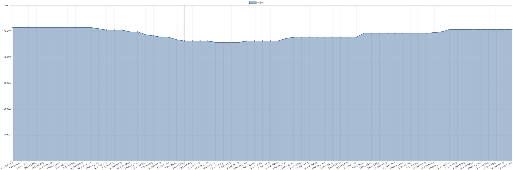

# 氧化镨价格变动趋势 

| 时间 | 价格 | 消息正文 |
|:--:|:--:|:--:|
|2023年6月1日|515000|6月1日氧化镨为515000.00|
|2023年5月31日|515000|5月31日氧化镨为515000.00|
|2023年5月30日|515000|5月30日氧化镨为515000.00|
|2023年5月29日|495000|5月29日氧化镨为495000.00|
|2023年5月26日|485000|5月26日氧化镨为485000.00|
|2023年5月25日|485000|5月25日氧化镨为485000.00|
|2023年5月24日|485000|5月24日氧化镨为485000.00|
|2023年5月23日|485000|5月23日氧化镨为485000.00|
|2023年5月22日|465000|5月22日氧化镨为465000.00|
|2023年5月19日|460000|5月19日氧化镨为460000.00|
|2023年5月18日|460000|5月18日氧化镨为460000.00|
|2023年5月17日|460000|5月17日氧化镨为460000.00|
|2023年5月16日|452500|5月16日氧化镨为452500.00|
|2023年5月15日|450000|5月15日氧化镨为450000.00|
|2023年5月12日|450000|5月12日氧化镨为450000.00|
|2023年5月11日|450000|5月11日氧化镨为450000.00|
|2023年5月10日|450000|5月10日氧化镨为450000.00|
|2023年5月9日|450000|5月9日氧化镨为450000.00|
|2023年5月8日|440000|5月8日氧化镨为440000.00|
|2023年5月5日|455000|5月5日氧化镨为455000.00|
|2023年5月4日|455000|5月4日氧化镨为455000.00|
|2023年5月3日|455000|5月3日氧化镨为455000.00|
|2023年5月2日|455000|5月2日氧化镨为455000.00|
|2023年5月1日|455000|5月1日氧化镨为455000.00|
|2023年4月28日|455000|4月28日氧化镨为455000.00|
|2023年4月27日|455000|4月27日氧化镨为455000.00|
|2023年4月26日|457500|4月26日氧化镨为457500.00|
|2023年4月25日|470000|4月25日氧化镨为470000.00|
|2023年4月24日|475000|4月24日氧化镨为475000.00|
|2023年4月21日|480000|4月21日氧化镨为480000.00|
|2023年4月20日|480000|4月20日氧化镨为480000.00|
|2023年4月19日|480000|4月19日氧化镨为480000.00|
|2023年4月18日|485000|4月18日氧化镨为485000.00|
|2023年4月17日|485000|4月17日氧化镨为485000.00|
|2023年4月14日|495000|4月14日氧化镨为495000.00|
|2023年4月13日|505000|4月13日氧化镨为505000.00|
|2023年4月12日|505000|4月12日氧化镨为505000.00|
|2023年4月11日|515000|4月11日氧化镨为515000.00|
|2023年4月10日|535000|4月10日氧化镨为535000.00|
|2023年4月7日|535000|4月7日氧化镨为535000.00|
|2023年4月6日|535000|4月6日氧化镨为535000.00|
|2023年4月5日|535000|4月5日氧化镨为535000.00|
|2023年4月4日|535000|4月4日氧化镨为535000.00|
|2023年4月3日|535000|4月3日氧化镨为535000.00|
|2023年3月31日|535000|3月31日氧化镨为535000.00|
|2023年3月30日|535000|3月30日氧化镨为535000.00|
|2023年3月29日|545000|3月29日氧化镨为545000.00|
|2023年3月28日|555000|3月28日氧化镨为555000.00|
|2023年3月27日|555000|3月27日氧化镨为555000.00|
|2023年3月24日|555000|3月24日氧化镨为555000.00|
|2023年3月23日|580000|3月23日氧化镨为580000.00|
|2023年3月22日|580000|3月22日氧化镨为580000.00|
|2023年3月21日|580000|3月21日氧化镨为580000.00|
|2023年3月20日|580000|3月20日氧化镨为580000.00|
|2023年3月17日|580000|3月17日氧化镨为580000.00|
|2023年3月16日|580000|3月16日氧化镨为580000.00|
|2023年3月15日|580000|3月15日氧化镨为580000.00|
|2023年3月14日|600000|3月14日氧化镨为600000.00|
|2023年3月13日|615000|3月13日氧化镨为615000.00|
|2023年3月10日|625000|3月10日氧化镨为625000.00|
|2023年3月9日|625000|3月9日氧化镨为625000.00|
|2023年3月8日|635000|3月8日氧化镨为635000.00|
|2023年3月7日|635000|3月7日氧化镨为635000.00|
|2023年3月6日|645000|3月6日氧化镨为645000.00|
|2023年3月3日|655000|3月3日氧化镨为655000.00|
|2023年3月2日|662500|3月2日氧化镨为662500.00|
|2023年3月1日|672500|3月1日氧化镨为672500.00|
|2023年2月28日|672500|2月28日氧化镨为672500.00|
|2023年2月27日|672500|2月27日氧化镨为672500.00|
|2023年2月24日|687500|2月24日氧化镨为687500.00|
|2023年2月23日|687500|2月23日氧化镨为687500.00|