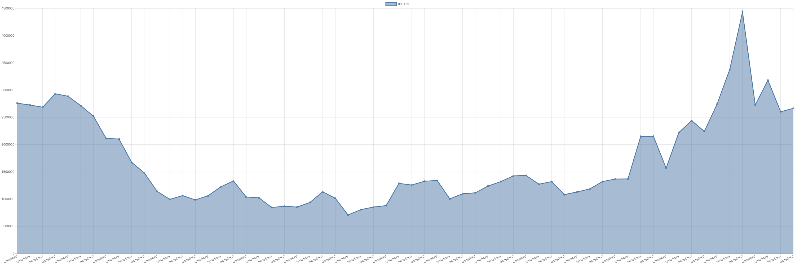

# 摩根史丹利-000429-持仓明细 

| 标的代码 | 标的名称 | 日期 | 持股数量 | A股占比 | 持股市值 |
|:--:|:--:|:--:|:--:|:--:|:--:|
|000429|粤高速A|2023-08-31|2666574|0.15|20265962.4|
|000429|粤高速A|2023-08-30|2602774|0.14|19702999.18|
|000429|粤高速A|2023-08-29|3181274|0.18|25004813.64|
|000429|粤高速A|2023-08-28|2728974|0.15|20712912.66|
|000429|粤高速A|2023-08-25|4434959|0.25|34193533.89|
|000429|粤高速A|2023-08-24|3380259|0.19|26027994.3|
|000429|粤高速A|2023-08-23|2740459|0.15|21348175.61|
|000429|粤高速A|2023-08-22|2242759|0.12|17493520.2|
|000429|粤高速A|2023-08-21|2440198|0.14|18643112.72|
|000429|粤高速A|2023-08-18|2221598|0.12|16773064.9|
|000429|粤高速A|2023-08-17|1568221|0.09|11808704.13|
|000429|粤高速A|2023-08-16|2151746|0.12|15987472.78|
|000429|粤高速A|2023-08-15|2150246|0.12|16105342.54|
|000429|粤高速A|2023-08-14|1369392|0.07|10174582.56|
|000429|粤高速A|2023-08-11|1367292|0.07|10008577.44|
|000429|粤高速A|2023-08-10|1321092|0.07|9802502.64|
|000429|粤高速A|2023-08-09|1185692|0.06|8797834.64|
|000429|粤高速A|2023-08-08|1130692|0.06|8434962.32|
|000429|粤高速A|2023-08-07|1081192|0.06|8011632.72|
|000429|粤高速A|2023-08-04|1320392|0.07|9823716.48|
|000429|粤高速A|2023-08-03|1272136|0.07|9617348.16|
|000429|粤高速A|2023-08-02|1431536|0.08|10822412.16|
|000429|粤高速A|2023-08-01|1425336|0.08|10846806.96|
|000429|粤高速A|2023-07-31|1320636|0.07|10116071.76|
|000429|粤高速A|2023-07-28|1238036|0.07|9470975.4|
|000429|粤高速A|2023-07-27|1114531|0.06|8459290.29|
|000429|粤高速A|2023-07-26|1096431|0.06|8267089.74|
|000429|粤高速A|2023-07-25|1003231|0.05|7554329.43|
|000429|粤高速A|2023-07-24|1341431|0.07|10181461.29|
|000429|粤高速A|2023-07-21|1326731|0.07|9937215.19|
|000429|粤高速A|2023-07-20|1256930|0.07|9351559.2|
|000429|粤高速A|2023-07-19|1287530|0.07|9656475|
|000429|粤高速A|2023-07-18|879664|0.05|6650259.84|
|000429|粤高速A|2023-07-14|852464|0.04|6282659.68|
|000429|粤高速A|2023-07-13|805178|0.04|6207922.38|
|000429|粤高速A|2023-07-12|707678|0.04|5442043.82|
|000429|粤高速A|2023-07-11|1014764|0.05|7813682.8|
|000429|粤高速A|2023-07-10|1132664|0.06|8744166.08|
|000429|粤高速A|2023-07-07|936280|0.05|7302984|
|000429|粤高速A|2023-07-06|852380|0.04|6631516.4|
|000429|粤高速A|2023-07-05|867380|0.04|6722195|
|000429|粤高速A|2023-07-04|845380|0.04|6585510.2|
|000429|粤高速A|2023-07-03|1022880|0.05|7968235.2|
|000429|粤高速A|2023-06-30|1036880|0.05|8129139.2|
|000429|粤高速A|2023-06-29|1331880|0.07|10362026.4|
|000429|粤高速A|2023-06-28|1224670|0.07|9552426|
|000429|粤高速A|2023-06-27|1059570|0.06|8232858.9|
|000429|粤高速A|2023-06-26|984770|0.05|7444861.2|
|000429|粤高速A|2023-06-21|1062670|0.06|8150678.9|
|000429|粤高速A|2023-06-20|994370|0.05|7646705.3|
|000429|粤高速A|2023-06-19|1140513|0.06|8816165.49|
|000429|粤高速A|2023-06-16|1477920|0.08|11527776|
|000429|粤高速A|2023-06-15|1672620|0.09|13247150.4|
|000429|粤高速A|2023-06-14|2102620|0.12|16694802.8|
|000429|粤高速A|2023-06-13|2111320|0.12|16911673.2|
|000429|粤高速A|2023-06-12|2519420|0.14|20230942.6|
|000429|粤高速A|2023-06-09|2715320|0.15|22102704.8|
|000429|粤高速A|2023-06-08|2887310|0.16|23589322.7|
|000429|粤高速A|2023-06-07|2932910|0.16|23639254.6|
|000429|粤高速A|2023-06-06|2686310|0.15|21060670.4|
|000429|粤高速A|2023-06-05|2726691|0.15|21540858.9|
|000429|粤高速A|2023-06-02|2760191|0.15|21446684.07|