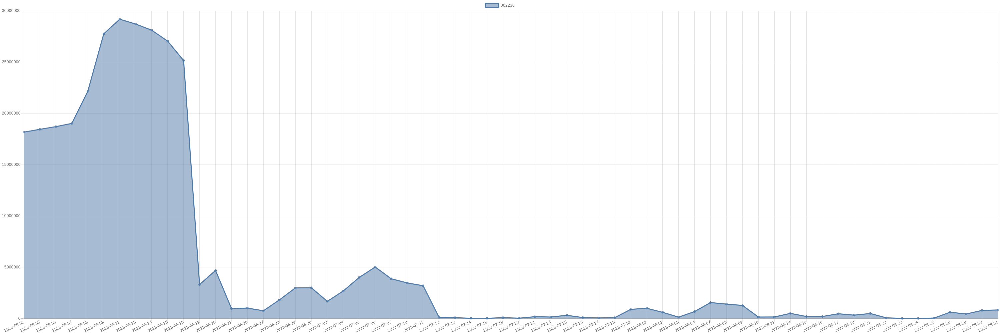

# 摩根史丹利-002236-持仓明细 

| 标的代码 | 标的名称 | 日期 | 持股数量 | A股占比 | 持股市值 |
|:--:|:--:|:--:|:--:|:--:|:--:|
|002236|大华股份|2023-08-31|829184|0.02|17893790.72|
|002236|大华股份|2023-08-30|782184|0.02|16762203.12|
|002236|大华股份|2023-08-29|435384|0.01|9321571.44|
|002236|大华股份|2023-08-28|607234|0.01|12272199.14|
|002236|大华股份|2023-08-25|37534|0|728159.6|
|002236|大华股份|2023-08-24|1334|0|26786.72|
|002236|大华股份|2023-08-23|3434|0|68336.6|
|002236|大华股份|2023-08-22|63434|0|1313083.8|
|002236|大华股份|2023-08-21|483934|0.01|9625447.26|
|002236|大华股份|2023-08-18|321634|0|6310459.08|
|002236|大华股份|2023-08-17|458578|0.01|9079844.4|
|002236|大华股份|2023-08-16|187900|0|3650897|
|002236|大华股份|2023-08-15|191215|0|3904610.3|
|002236|大华股份|2023-08-14|496271|0.01|10307548.67|
|002236|大华股份|2023-08-11|145900|0|2982196|
|002236|大华股份|2023-08-10|138477|0|2926019.01|
|002236|大华股份|2023-08-09|1269677|0.03|26828275.01|
|002236|大华股份|2023-08-08|1397080|0.04|30596052|
|002236|大华股份|2023-08-07|1549500|0.04|34600335|
|002236|大华股份|2023-08-04|672500|0.02|14990025|
|002236|大华股份|2023-08-03|129000|0|2706420|
|002236|大华股份|2023-08-02|597100|0.01|12891389|
|002236|大华股份|2023-08-01|995200|0.02|21625696|
|002236|大华股份|2023-07-31|884400|0.02|19412580|
|002236|大华股份|2023-07-28|80000|0|1636800|
|002236|大华股份|2023-07-27|50300|0|1008515|
|002236|大华股份|2023-07-26|85800|0|1747746|
|002236|大华股份|2023-07-25|308632|0|6527566.8|
|002236|大华股份|2023-07-24|140500|0|2929425|
|002236|大华股份|2023-07-21|173400|0|3565104|
|002236|大华股份|2023-07-20|23700|0|494145|
|002236|大华股份|2023-07-19|82000|0|1805640|
|002236|大华股份|2023-07-18|9000|0|197100|
|002236|大华股份|2023-07-14|10900|0|239691|
|002236|大华股份|2023-07-13|80682|0|1815345|
|002236|大华股份|2023-07-12|99600|0|2159328|
|002236|大华股份|2023-07-11|3187780|0.09|69079192.6|
|002236|大华股份|2023-07-10|3467196|0.1|71805629.16|
|002236|大华股份|2023-07-07|3868496|0.11|80619456.64|
|002236|大华股份|2023-07-06|5013496|0.15|108742728.24|
|002236|大华股份|2023-07-05|4001301|0.12|85787893.44|
|002236|大华股份|2023-07-04|2679893|0.08|57698096.29|
|002236|大华股份|2023-07-03|1668407|0.05|33284719.65|
|002236|大华股份|2023-06-30|2991417|0.08|59080485.75|
|002236|大华股份|2023-06-29|2977417|0.08|58744437.41|
|002236|大华股份|2023-06-28|1810100|0.05|34753920|
|002236|大华股份|2023-06-27|747941|0.02|15744158.05|
|002236|大华股份|2023-06-26|1010714|0.03|21356386.82|
|002236|大华股份|2023-06-21|963700|0.02|21297770|
|002236|大华股份|2023-06-20|4677250|0.14|111178232.5|
|002236|大华股份|2023-06-19|3307322|0.09|76564504.3|
|002236|大华股份|2023-06-16|25140561|0.75|537505194.18|
|002236|大华股份|2023-06-15|27032023|0.81|525502527.12|
|002236|大华股份|2023-06-14|28096408|0.84|574571543.6|
|002236|大华股份|2023-06-13|28695127|0.86|576198150.16|
|002236|大华股份|2023-06-12|29166347|0.87|549493977.48|
|002236|大华股份|2023-06-09|27742451|0.83|520170956.25|
|002236|大华股份|2023-06-08|22136051|0.66|426783063.28|
|002236|大华股份|2023-06-07|19010751|0.57|373751364.66|
|002236|大华股份|2023-06-06|18696068|0.56|370556067.76|
|002236|大华股份|2023-06-05|18434589|0.55|386204639.55|
|002236|大华股份|2023-06-02|18159745|0.54|375180331.7|