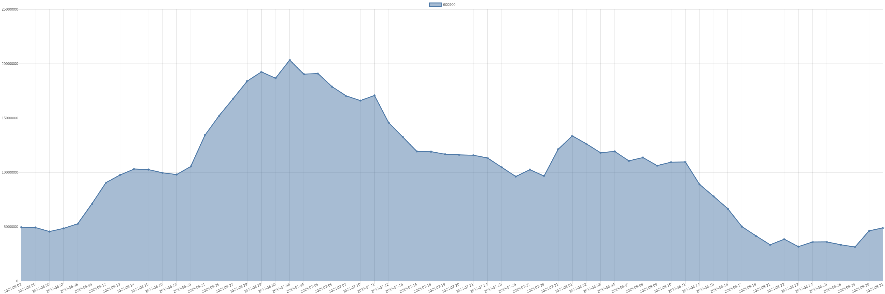

# 摩根史丹利-600900-持仓明细 

| 标的代码 | 标的名称 | 日期 | 持股数量 | A股占比 | 持股市值 |
|:--:|:--:|:--:|:--:|:--:|:--:|
|600900|长江电力|2023-08-31|4908413|0.02|108279590.78|
|600900|长江电力|2023-08-30|4632038|0.02|101765874.86|
|600900|长江电力|2023-08-29|3137281|0.01|68769199.52|
|600900|长江电力|2023-08-28|3348681|0.01|74072823.72|
|600900|长江电力|2023-08-25|3611681|0.01|80034850.96|
|600900|长江电力|2023-08-24|3603881|0.01|78456489.37|
|600900|长江电力|2023-08-23|3173782|0.01|69664514.9|
|600900|长江电力|2023-08-22|3859982|0.01|84919604|
|600900|长江电力|2023-08-21|3346745|0.01|73126378.25|
|600900|长江电力|2023-08-18|4164634|0.01|91871826.04|
|600900|长江电力|2023-08-17|5021493|0.02|111075425.16|
|600900|长江电力|2023-08-16|6667593|0.02|145820258.91|
|600900|长江电力|2023-08-15|7799793|0.03|171751441.86|
|600900|长江电力|2023-08-14|8909143|0.03|194308408.83|
|600900|长江电力|2023-08-11|10966948|0.04|238531119|
|600900|长江电力|2023-08-10|10950488|0.04|241896279.92|
|600900|长江电力|2023-08-09|10629776|0.04|235024347.36|
|600900|长江电力|2023-08-08|11373780|0.05|251360538|
|600900|长江电力|2023-08-07|11068929|0.04|242630923.68|
|600900|长江电力|2023-08-04|11937120|0.05|257125564.8|
|600900|长江电力|2023-08-03|11813261|0.05|255875233.26|
|600900|长江电力|2023-08-02|12629198|0.05|272664384.82|
|600900|长江电力|2023-08-01|13367098|0.05|290333368.56|
|600900|长江电力|2023-07-31|12134187|0.05|260399653.02|
|600900|长江电力|2023-07-28|9666287|0.04|206278564.58|
|600900|长江电力|2023-07-27|10262487|0.04|217872599.01|
|600900|长江电力|2023-07-26|9626976|0.04|205921016.64|
|600900|长江电力|2023-07-25|10479732|0.04|223532683.56|
|600900|长江电力|2023-07-24|11333141|0.04|244342519.96|
|600900|长江电力|2023-07-21|11586641|0.05|250271445.6|
|600900|长江电力|2023-07-20|11619669|0.05|260280585.6|
|600900|长江电力|2023-07-19|11674421|0.05|262674472.5|
|600900|长江电力|2023-07-18|11916083|0.05|267039420.03|
|600900|长江电力|2023-07-14|11933230|0.05|268139678.1|
|600900|长江电力|2023-07-13|13263699|0.05|297372131.58|
|600900|长江电力|2023-07-12|14583109|0.06|322870033.26|
|600900|长江电力|2023-07-11|17082151|0.07|375807322|
|600900|长江电力|2023-07-10|16613251|0.07|365491522|
|600900|长江电力|2023-07-07|17043674|0.07|374960828|
|600900|长江电力|2023-07-06|17892717|0.07|393639774|
|600900|长江电力|2023-07-05|19101774|0.08|421576152.18|
|600900|长江电力|2023-07-04|19040146|0.08|419835219.3|
|600900|长江电力|2023-07-03|20340861|0.08|449939845.32|
|600900|长江电力|2023-06-30|18668561|0.08|411828455.66|
|600900|长江电力|2023-06-29|19252361|0.08|426054748.93|
|600900|长江电力|2023-06-28|18411273|0.08|413885417.04|
|600900|长江电力|2023-06-27|16794673|0.07|371498166.76|
|600900|长江电力|2023-06-26|15213769|0.06|338354222.56|
|600900|长江电力|2023-06-21|13418915|0.05|296558021.5|
|600900|长江电力|2023-06-20|10551515|0.04|233082966.35|
|600900|长江电力|2023-06-19|9807942|0.04|217540153.56|
|600900|长江电力|2023-06-16|9967143|0.04|221270574.6|
|600900|长江电力|2023-06-15|10266543|0.04|228738578.04|
|600900|长江电力|2023-06-14|10317278|0.04|229559435.5|
|600900|长江电力|2023-06-13|9768224|0.04|217831395.2|
|600900|长江电力|2023-06-12|9065248|0.03|202880250.24|
|600900|长江电力|2023-06-09|7107289|0.03|162472626.54|
|600900|长江电力|2023-06-08|5278164|0.02|119603196.24|
|600900|长江电力|2023-06-07|4853750|0.02|108432775|
|600900|长江电力|2023-06-06|4565150|0.02|101894148|
|600900|长江电力|2023-06-05|4935750|0.02|110807587.5|
|600900|长江电力|2023-06-02|4949550|0.02|110523451.5|